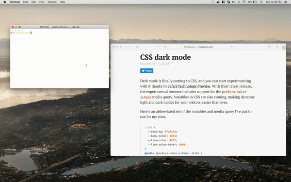

# PowerShell-Lumos

[](https://dev.azure.com/markwragg/GitHub/_build/latest?definitionId=1&branchName=master) 

A PowerShell module for switching Windows 10 and MacOS Mojave between light and dark themes depending on whether it is day or night.

__Windows:__


__macOS:__



This module is published in the PowerShell Gallery, so can be installed via:

```PowerShell
Install-Module Lumos
```

## Usage

You can manually trigger Lumos as follows:

```PowerShell
Invoke-Lumos
```

On Windows, this will get your geographical coordinates from your local system and then use these to query a web API for the sunrise and sunset times for your location.
If the sun is down, the theme will be set to dark.
If the sun is up, the theme will be set to light.

On MacOS Mojave, using `Invoke-Lumos` with no switches will switch the theme to its alternate, i.e if it's Light it will switch to Dark and if Dark switch to Light.

You can also simply use the alias `Lumos`.

You can explicitly specify whether you want the Dark or Light modes on both Windows 10 and MacOS Mojave with the following switches:

```PowerShell
Invoke-Lumos -Dark

Invoke-Lumos -Light
```

By default the cmdlet will change both the System and Application themes, but on Windows 10 if you'd like to just change one of these you can exclude the other by using these switches:

```PowerShell
Invoke-Lumos -Dark -ExcludeSystem

Invoke-Lumos -Light -ExcludeApps
```
These switches are not available on MacOS Mojave.

If you'd like your wallpaper to change with the theme (on Windows 10 or MacOS Mojave), you can specify a path to these:

```PowerShell
Invoke-Lumos -Dark -DarkWallpaper c:\wallpaper\dark.png

Invoke-Lumos -Light -LightWallpaper /Users/markwragg/Pictures/light.jpg
```

If you'd like change the theme of your Office ProPlus installation on Windows 10, you can pass the `-IncludeOfficeProPlus` flag. It will update your Office Clients to switch to either the Dark or Light mode. Note that it requires a restart of your Office Applications before it takes effect.

```PowerShell
Invoke-Lumos -Dark -IncludeOfficeProPlus
```

On Windows, when the System theme changes, Lumos applies it to the taskbar by broadcasting a `WM_SETTINGCHANGE` message rather than restarting Explorer. If that doesn't refresh the taskbar on your system, add `-RestartExplorer` to fall back to the old behavior:

```PowerShell
Invoke-Lumos -Dark -RestartExplorer
```

## Scheduling

If you'd like Windows 10 to automatically switch from Light to Dark mode based on your local sunrise/sunset times, you can use the following cmdlet to add a Scheduled Task to do so (this cmdlet does not currently support MacOS Mojave):

```PowerShell
Register-LumosScheduledTask
```

This registers a "Lumos" scheduled task that runs `Invoke-Lumos` twice a day, at your local sunrise and sunset, plus a second "Lumos-Maintenance" task that runs once a week to keep those times current as sunrise/sunset drift through the year. Both tasks run as your own (non-administrator) user account.

You can specify any of the `Invoke-Lumos` switches above when registering the task to customize the result. For example:

```PowerShell
Register-LumosScheduledTask -ExcludeApps -DarkWallpaper c:\wallpaper\dark.png -LightWallpaper c:\wallpaper\light.png
```

If you'd rather not have Lumos look up your location, you can specify fixed daily times yourself with `-Sunrise`/`-Sunset`, or reuse whatever schedule Windows' own Night Light feature (Settings > System > Display > Night light) is already configured with via `-FromNightLight`. Since neither of these needs to be kept in sync with the season, the "Lumos-Maintenance" task isn't registered in either case (and is removed if one was already registered from a previous, non-fixed run) - re-run the cmdlet if you want to pick up a later change:

```PowerShell
Register-LumosScheduledTask -Sunrise '07:00' -Sunset '19:00'

Register-LumosScheduledTask -FromNightLight
```

`Register-LumosScheduledTask` returns the scheduled task(s) it registered, showing the source and times that were used, so you can confirm what was set up:

```
TaskName           Source       Schedule                           State
--------           ------       --------                           -----
Lumos              Location     Light 07:00, Dark 19:00            Ready
Lumos-Maintenance  Location     Weekly Wednesday 13:00             Ready
```
